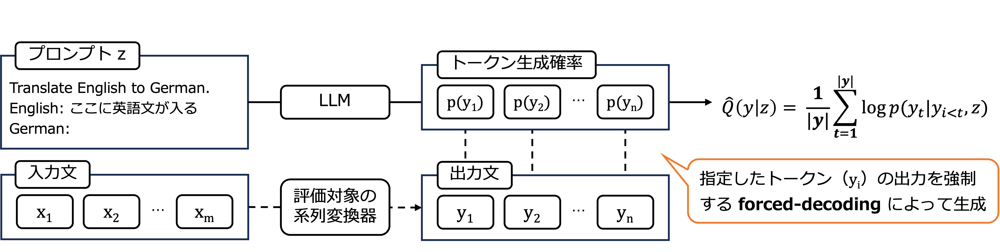

# LFORD

### 概要
LFORD ( **L**LM-based **For**ced **D**ecoding )は、LLM の文生成確率に基づく教師なし品質推定手法です。


LFORDは、様々な言語生成タスクに適用可能ですが、このレポジトリでは英日の機械翻訳向けに実装しています。


### 使用方法
```
python evaluate.py
    --src_file_path XXX.en
    --tgt_file_path YYY.ja
    --output_file_dir ZZZ
```

### 文献情報
樽本空宙, 梶原智之, 二宮崇. 大規模言語モデルの文生成確率を用いた教師なし品質推定.<br>
言語処理学会第31回年次大会  [[pdf](https://www.anlp.jp/proceedings/annual_meeting/2025/pdf_dir/P7-10.pdf)]